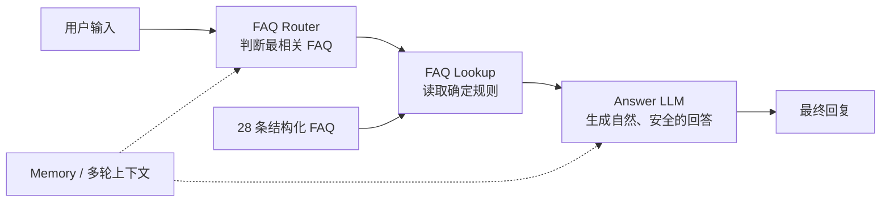

# HelpFlow AI 智能客服

> 个人 AI 产品作品集 Demo｜从产品定义到评测迭代的完整实践

| 结构化 FAQ | 正式测试 | 业务正确性 | Full 一次性端到端成功率 |
| ---: | ---: | ---: | ---: |
| 28 条 | 50 条 | **50/50（100%）** | **46/50（92%）** |

## 项目简介

HelpFlow 是一个面向中小企业客服场景的虚构 SaaS 产品。我独立完成用户场景、PRD、产品规则、AI 应用结构、测试评测与迭代验证，目标是让系统只在有 FAQ 依据时回答，在模糊、无依据或敏感场景中保持谨慎。

[阅读完整项目概览](docs/01-project-overview.md)

## 用户问题 / 项目目标

- 高频账号、套餐、退款、发票、权限和数据问题重复占用人工时间。
- 价格、退款和权限口径需要保持一致，避免模型凭常识补充产品规则。
- 模糊指代、账号安全和敏感信息场景需要先澄清或安全拒答。

项目重点不是增加功能，而是完成一条可验证的产品闭环：**产品定义 → AI 方案 → 测试 → Trace 定位 → 最小修改 → 回归验证**。

## 核心架构



对于 28 条固定 FAQ，Router + Lookup 能把“选哪条规则”和“如何表达”分开，便于控制知识边界并定位责任层。详细说明见 [系统架构](docs/02-architecture.md)。

## 我做了什么

- 定义用户场景，编写精简 PRD 和账号、套餐、退款、权限等产品规则。
- 整理 28 条结构化 FAQ，统一分类、关键词和回答口径。
- 设计 Router → Lookup → Answer LLM 三层方案，支持多轮上下文、模糊澄清和安全回答。
- 设计 50 条正式测试，覆盖正常问答、多轮、拒答、错误前提和敏感信息。
- 搭建批量执行与人工评测流程，通过 Trace 定位问题并完成 V0.1 → V0.2 迭代。

公开材料提供 [8 条 FAQ 样例](knowledge-base/faq-sample.md)、[12 条测试样例](evaluation/test-cases-sample.md) 和 [脱敏后的样例执行器](evaluation/batch-runner/README.md)。

## 关键迭代案例

| 案例 | 发现的问题 | 定位与最小修改 | 回归结果 |
| --- | --- | --- | --- |
| T041 | “那年付呢？”未稳定承接专业版 | Router 开启 Memory | 多轮通过 |
| T042 | “他”未承接为普通成员 | Trace 证明 Router / Lookup 正确；Answer Prompt 增加 C01 | 指代回答通过 |
| T039 | `NO_MATCH` 后直接转人工 | Answer Prompt 增加 C02 / C02.1，模糊指代先澄清 | 澄清行为通过 |

完整过程见 [V0.1 → V0.2 迭代](docs/04-iteration-v0.1-v0.2.md)。

## 最终评测结果

- **业务正确性：50/50（100%）**——50 条测试最终都取得符合预期的业务回答。
- **Full 一次性端到端成功率：46/50（92%）**——一次 Full 中 4 条因延迟超时。
- **业务逻辑失败：0**。
- T014、T015、T048、T049 的 single 回归全部成功，因此属于性能或上游稳定性波动，不是业务回答错误。
- 当前主要风险是免费模型服务或 Dify 上游的延迟波动与偶发超时。

两个百分比衡量不同问题，不能合并：100% 表示回答质量，92% 表示一次执行稳定性。评测口径见 [评测方案与结果](docs/03-evaluation.md)。

## 项目亮点

- **产品定义：** 先明确用户问题、产品规则和风险边界，再选择实现方式。
- **AI 应用设计：** 拆分路由、规则读取和回答生成，降低错误归因难度。
- **Prompt 迭代：** 每项修改都对应真实失败案例，不通过扩大范围“修分”。
- **评测方法：** 固定测试集、人工评分、单题回归和 Full 回归形成可复现证据。
- **诚实呈现：** 区分业务正确性与链路稳定性，不把 Demo 结果包装成生产能力。

## 仓库结构

```text
.
├─ README.md
├─ docs/
│  ├─ 01-project-overview.md
│  ├─ 02-architecture.md
│  ├─ 03-evaluation.md
│  └─ 04-iteration-v0.1-v0.2.md
├─ knowledge-base/
│  └─ faq-sample.md
├─ evaluation/
│  ├─ test-cases-sample.md
│  └─ batch-runner/
│     ├─ README.md
│     ├─ run-sample-evaluation.mjs
│     └─ .env.example
├─ assets/
│  └─ README.md
└─ .gitignore
```

## 说明与免责声明

HelpFlow 为个人作品集 Demo。品牌、产品价格、联系邮箱、业务规则及测试数据均为虚构演示内容，不代表真实商业服务。

公开仓库仅保留代表性 FAQ、测试样例和脱敏后的评测执行器；完整知识库、完整 50 条测试、原始回答、评分明细和内部诊断记录未公开。仓库不包含任何真实密钥、个人账号或真实业务数据。
