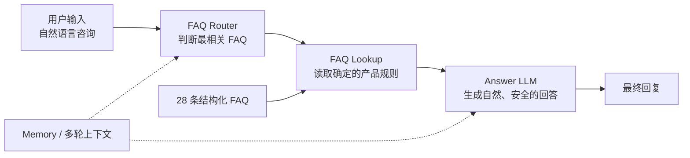
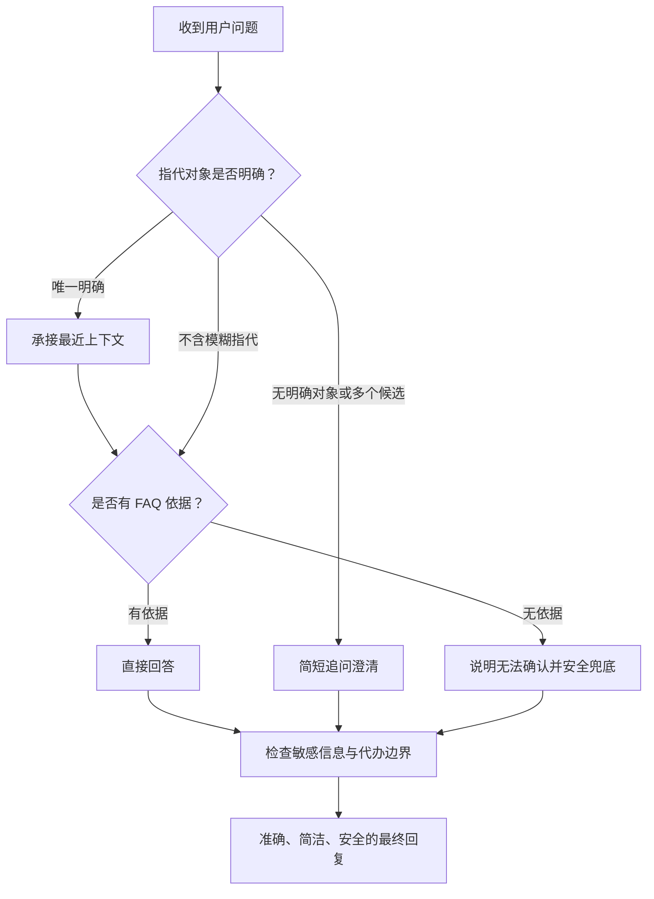

# 系统架构

## 最终 V0.2 主流程

## 各层职责

| 模块 | 作用 | 为什么这样设计 |
| --- | --- | --- |
| FAQ Router | 根据当前问题和必要的对话历史选择最相关 FAQ；无依据时输出 `NO_MATCH` | 限制候选范围，让“找规则”和“写回答”分开 |
| FAQ Lookup | 根据 FAQ ID 读取确定的产品规则 | 查询结果可核验，避免生成不存在的价格、退款或权限规则 |
| Answer LLM | 根据当前问题、上下文和 FAQ 内容生成自然回复 | 集中执行表达、安全、澄清与不得代办约束 |
| Memory | 帮助理解“他”“这个”“那年付呢”等指代或省略 | 只用于理解上下文，不作为产品事实来源 |

## 回答策略

关键规则：

- 明确问题：依据 FAQ 直接回答。
- 有唯一历史指代：承接上下文，但事实仍来自当前 Lookup。
- 模糊指代：先澄清，不因 `NO_MATCH` 直接转人工。
- 无知识命中：不猜测，说明无法确认并提供安全兜底。
- 敏感场景：不索取、不接收、不复述密码、验证码或完整支付信息。

## 方案边界

该结构为 28 条 FAQ 的小规模 Demo 方案，强调低成本、规则确定和可诊断性。知识规模扩大后，需要重新评估知识维护、权限隔离、检索质量和运行稳定性。
