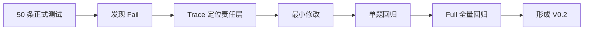

# V0.1 → V0.2 产品迭代

## 迭代方法

每次只修改证据指向的问题层，随后先验证单题，再使用原测试集检查回归风险。

## T041：多轮“那年付呢？”

**问题**

第一轮询问“专业版月付多少钱？”，第二轮只问“那年付呢？”。系统未稳定承接“专业版”。

**定位与修改**

问题属于多轮路由上下文不足。开启 Router Memory，让路由判断能参考最近对话，而不是把省略问法当成独立问题。

**验证**

回归后三轮均通过：正确回答专业版月付、年付，并能继续切换到首购退款问题。

## T042：“他”指代普通成员

**问题**

“那普通成员呢？”之后继续问“他能删除客户吗？”，Answer 再次询问角色。

**Trace 证据**

- Router 输出 `FAQ-019`。
- Lookup 状态为 `MATCH`，返回的规则明确普通成员不能删除客户。
- 因此 Router 与 Lookup 正确，责任层确定为 Answer LLM。

**最小修改 C01**

当最近历史存在唯一、明确的指代对象时，Answer 必须直接承接，不得重复询问；对话历史只用于理解指代，产品事实仍来自 Lookup。

**验证**

回归后正确理解“他”是普通成员，并回答普通成员不能删除客户。

## T039：“这个能改吗？”

**问题**

用户没有说明“这个”是什么。Router 合理输出 `NO_MATCH`，但 Answer 随后直接执行资料不足和转人工兜底，没有先澄清。

**Trace 证据**

问题不在 Router，而在 Answer Prompt 中“模糊指代澄清”与普通 `NO_MATCH` 兜底的优先级冲突。

**最小修改 C02 / C02.1**

- C02：没有唯一对象或存在多个候选时，简短追问具体对象，不猜测、不直接拒答。
- C02.1：先判断指代，再判断 `NO_MATCH`；命中 C02 后立即澄清并停止。

**验证**

回归后系统先询问用户指账号邮箱、成员角色、客户资料还是其他内容，不再直接转人工。

## 前后结果

| 指标 | V0.1 有效基线 | V0.2 |
| --- | ---: | ---: |
| 业务 Overall Pass | 45/50（90%） | 50/50（100%） |
| 多轮测试通过率 | 1/4（25%） | 4/4（100%） |
| 幻觉数 | 0 | 0 |

V0.2 Full 一次性端到端成功率为 46/50（92%）。四条超时经 single 回归均取得正确回答，说明回答逻辑已经通过，但运行稳定性仍需继续验证。

## 迭代结论

- C01、C02、C02.1 都来自真实失败和 Trace 证据。
- 未通过扩充功能或修改测试集提高分数。
- 业务正确性和端到端稳定性分别统计。
- 当前遗留问题集中在免费模型服务或 Dify 上游的延迟波动。
